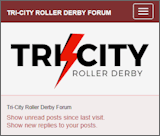

# Tri-City Flexive
  

A modern, responsive theme for [Simple Machines Forum](https://www.simplemachines.org/about/smf/).

### Features
- Bootstrap
- FontAwesome
- Social networks
- Logo URL
- Custom background
- Separate sticky topics
- Dark theme variant

### Credits
* Based on Flexive v1 designed by [Diego Andrés](https://github.com/DiegoAndresCortes)
* Customized by [Juniper Inglis](https://github.com/juniperliketheberries) aka Gin & Toxic 140° for Tri-City Roller Derby

---

